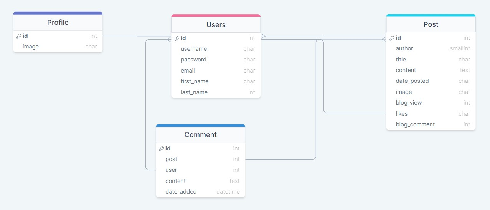

# Full Stack - Blog App - Backend
<!-- Please update value in the {}  -->

<h1 align="center">Django Blog App</h1>

<div align="center">
  <h3> 
    <a href="https://esadd.pythonanywhere.com/">
      👉 Project Link 👈
    </a> 
  </h3>
</div>

<!-- TABLE OF CONTENTS -->

## Table of Contents

- [Overview](#overview) 
- [Entity Relationship Diagram](#entity-relationship-diagram)
- [Preview](#preview-of-the-project)
- [Built With](#built-with)
- [Project Structure](#project-structure)
- [How to use](#how-to-use)
- [Contact](#contact)

<!-- OVERVIEW -->

## Overview

- Created a Blog application with Django that allows users to create, edit and delete posts.
- The homepage lists all blog posts and each post has a dedicated detail page for comments and likes.
- Notions I have learned from this projects are includes authentication, database relations, Class based views and Function based views, Django Template language, and HTMX. 
## Entity Relationship Diagram

<!--  -->


## Preview of the Project


<!--  -->

### Built With

<!-- This section should list any major frameworks that you built your project using. Here are a few examples.-->

- HTML
- CSS
- JS
- Django
- Bootstrap
- SASS

## Project Structure

```bash
.──── django-blog-app (repo)
│
├── main
│   ├── __init__.py
│   ├── __pycache__
│   ├── asgi.py
│   ├── settings.py
│   ├── urls.py
│   └── wsgi.py
│
│─── blog
│     │── __init__.py
│     ├── __pycache__
│     ├── admin.py
│     ├── apps.py
│     ├── migrations
│     ├── models.py
│     ├── static
│     │   └── blog
│     │       ├── images
│     │       │   └── logo.png
│     │       ├── css
│     │       │   ├── main.scss
│     │       │   └── style.css
│     │       └── js
│     │           └── app.js
│     ├── templates
│     │   └── blog
│     │       ├── home.html
│     │       ├── likes_area.html
│     │       ├── post_confirm_delete.html
│     │       ├── post_detail.html
│     │       ├── post_form.html
│     │       └── post_detail.html
│     ├── tests.py
│     ├── urls.py
│     └── views.py
├──── users
│      ├── __init__.py
│      ├── __pycache__
│      ├── admin.py
│      ├── migrations
│      ├── apps.py
│      ├── forms.py
│      ├── models.py
│      ├── signals.py
│      ├── models.py
│      ├── templates
│      │   └── users
│      │       ├── login.html
│      │       ├── profile.html
│      │       └── register.html
│      ├── tests.py
│      ├── urls.py
│      └── views.py
│─── templates
│      ├── base.html
│      ├── footer.html
│      └── navbar.html
├─── media
│      ├── profile_pics
│      ├── user_directory_path
│      ├── blog_default_png
│      └── default.webp
├── manage.py
├── db.sqlite3
├── requirements.txt
└── .env

```

## How To Use

To clone and run this application, you'll need [Git](https://git-scm.com)

```bash
# Clone this repository
$ git clone https://github.com/esadakman/django-blog-app

# Install dependencies
    $ python -m venv env
    > env/Scripts/activate (for win OS)
    $ source env/bin/activate (for macOs/linux OS)
    $ pip install -r requirements.txt

# Add .env file for secret key
    add your SECRET_KEY in a .env file

# Run the app
    $ python manage.py runserver
```

## Contact

- Website [@esadakman](https://esadakman.github.io/)
- GitHub [@esadakman](https://github.com/esadakman)
- Linkedin [@esadakman](https://www.linkedin.com/in/esadakman/)
